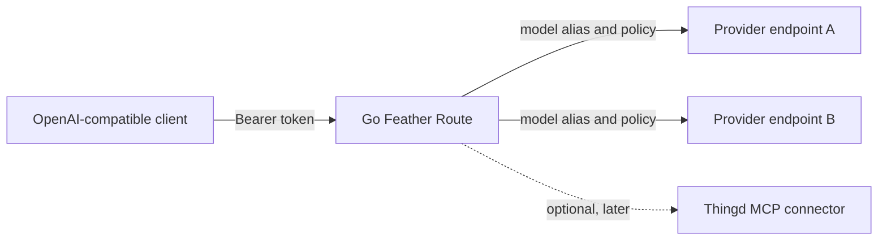

# Go Feather Route

[](https://github.com/sayanmohsin/go-feather-route/actions/workflows/ci.yml)
[](https://sayanmohsin.github.io/go-feather-route/)
[](https://hub.docker.com/r/sayanmohsin/go-feather-route)
[](https://go.dev/)
[](LICENSE)

## A fast, featherweight, OpenAI-compatible model-routing gateway written in Go

Go Feather Route is a small gateway for routing chat requests to
OpenAI-compatible provider endpoints. It gives applications one authenticated
boundary for provider credentials, model aliases, request limits, retries,
timeouts, and streaming responses.

It is designed for small VMs, edge services, homelabs, containers, and teams
that want a focused routing layer without a database, queue, dashboard, or
large platform runtime.

[Documentation](https://sayanmohsin.github.io/go-feather-route/) · [API reference](docs/api.md) · [Benchmarks](docs/benchmarks.md) · [Docker Hub](https://hub.docker.com/r/sayanmohsin/go-feather-route)

## Capabilities

- OpenAI-compatible Chat Completions requests and errors.
- Configurable provider base URLs and model aliases.
- Non-streaming and Server-Sent Events streaming responses.
- Bounded request bodies, timeouts, retries, and concurrent work.
- Liveness, readiness, status, model status, and Prometheus-style metrics.
- Provider credentials supplied only at runtime through environment injection.
- Static, non-root, multi-architecture Docker images.
- Optional Thingd MCP connectivity as a separate capability boundary.

## Architecture



The router does not embed Thingd and does not access databases directly. The
optional connector uses the authenticated Thingd MCP boundary when enabled.

## Quickstart

Prerequisites: Go 1.26 and provider credentials.

```bash
cp .env.example .env
export GOFEATHERROUTE_API_KEY=gateway-key
export OPENAI_API_KEY=your-key
go run ./cmd/go-feather-route
```

Check health and models:

```bash
curl http://127.0.0.1:4000/health/liveliness
curl -H 'Authorization: Bearer gateway-key' \
  http://127.0.0.1:4000/v1/models
```

Send a chat request:

```bash
curl http://127.0.0.1:4000/v1/chat/completions \
  -H 'Authorization: Bearer gateway-key' \
  -H 'Content-Type: application/json' \
  -d '{"model":"gpt-4o-mini","messages":[{"role":"user","content":"Say hello."}]}'
```

Try streaming:

```bash
curl -N http://127.0.0.1:4000/v1/chat/completions \
  -H 'Authorization: Bearer gateway-key' \
  -H 'Content-Type: application/json' \
  -d '{"model":"gpt-4o-mini","stream":true,"messages":[{"role":"user","content":"Tell me a short story."}]}'
```

## Docker

```bash
docker run --rm -p 4000:4000 \
  -e GOFEATHERROUTE_API_KEY=gateway-key \
  -e OPENAI_API_KEY=your-key \
  sayanmohsin/go-feather-route:0.1.0
```

Use Doppler, your deployment secret manager, or an equivalent runtime injector
for production credentials. Never put real credentials in a Dockerfile,
`.env.example`, committed Compose file, or image layer.

## Configuration model

Configuration precedence is supported CLI flags (`-config`, `-addr`) → environment → YAML file → safe defaults.
Non-secret defaults belong in `config/defaults.yaml`; credentials belong in
environment variables and can be injected by Doppler or CI. See the
[environment guide](docs/environment.md) and [configuration guide](docs/configuration.md).

## Resource profile

The benchmark harness compares the Go gateway with a pinned LiteLLM image
against the same deterministic fake provider. It records latency, throughput,
CPU, memory, I/O, process count, cgroup peaks, and OOM state where the host
exposes those measurements. The homepage shows a concise summary; the full
[benchmark methodology and results](docs/benchmarks.md) explain platform and
architecture context before the numbers are interpreted.

## Long-term direction

Go Feather Route is intended to grow into a small operational boundary for
model access: more OpenAI-compatible providers, embeddings and multimodal
requests, per-tenant quotas, usage metrics, health-aware routing, graceful
degradation, memory-aware deployment profiles, and optional Thingd MCP data
capabilities. The standalone router remains useful without Thingd.

## Documentation

- [Documentation site](https://sayanmohsin.github.io/go-feather-route/)
- [Getting started](docs/getting-started.md)
- [API reference](docs/api.md)
- [OpenAPI contract](docs/openapi.yaml)
- [Providers and routing](docs/providers.md)
- [Environment configuration](docs/environment.md)
- [Streaming](docs/streaming.md)
- [Health and operations](docs/health.md)
- [Docker deployment](docs/docker.md)
- [Benchmarks](docs/benchmarks.md)
- [LiteLLM compatibility contract](docs/litellm-compatibility.md)
- [Compatibility gap matrix](docs/compatibility-gaps.md)
- [Optional Thingd MCP connector](docs/thingd-mcp.md)
- [Contributing](CONTRIBUTING.md)
- [Security](SECURITY.md)

## Development

```bash
make tools
make check
make bench
```

See [coding standards](docs/standards.md) for the project contract.

## License

Go Feather Route is available under the [Apache License 2.0](LICENSE).
