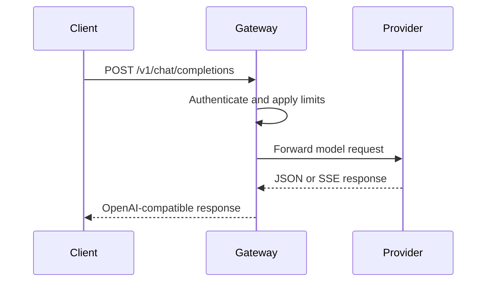

# API reference

Go Feather Route exposes a small OpenAI-compatible surface plus operational
endpoints. The complete machine-readable contract is in
[`openapi.yaml`](openapi.yaml).

## Request flow



## Authentication

Set `Authorization: Bearer <GOFEATHERROUTE_API_KEY>` for protected routes:

- `GET /v1/models`
- `POST /v1/chat/completions`
- `GET /status/models`
- `GET /status/models/{model}`

Liveness, readiness, aggregate status, metrics, and the container healthcheck
path are unauthenticated so infrastructure can probe them.

## Endpoints

### Health and operations

- `GET /health/live` and `/health/liveliness` return `{ "object": "health", "status": "ok" }`.
- `GET /ready` returns `200` when at least one configured route has provider credentials, otherwise `503`.
- `GET /status` returns gateway counters and configured model count.
- `GET /status/models` lists aliases; `/status/models/{model}` returns route and credential status.
- `GET /metrics` returns Prometheus-compatible counters.

Gateway responses include `Server: Go-Feather-Route` and a generated or
preserved `X-Request-ID`. Provider rate-limit headers are forwarded from a
small allowlist; hop-by-hop and authorization headers are never returned.

### `GET /v1/models`

Returns configured model aliases in OpenAI list format.

### `POST /v1/embeddings`

Accepts an OpenAI-compatible embedding request. `model` and `input` are
required; `input` may be a string or an array of strings. The request is
forwarded to the selected provider and the provider response, including usage
metadata and vector indexes, is preserved within the configured response limit.

```bash
curl http://127.0.0.1:4000/v1/embeddings \
  -H 'Authorization: Bearer gateway-key' \
  -H 'Content-Type: application/json' \
  -d '{"model":"text-embedding-3-small","input":["first record","second record"]}'
```

### `POST /v1/chat/completions`

Accepts an OpenAI-compatible chat request. `model` is required. The body is
forwarded to the selected provider after gateway limits and routing are
applied. Use `stream: true` for Server-Sent Events forwarding.

```bash
curl http://127.0.0.1:4000/v1/chat/completions \
  -H 'Authorization: Bearer gateway-key' \
  -H 'Content-Type: application/json' \
  -d '{"model":"gpt-4o-mini","messages":[{"role":"user","content":"Hello"}]}'
```

## Errors

Errors use the OpenAI-compatible shape:

```json
{"error":{"message":"invalid or missing bearer token","type":"go_feather_route_error"}}
```

The gateway uses `401` for authentication failures, `400` for invalid input,
`413` for oversized bodies, `502` for upstream failures, and `503` for
degraded readiness.

Multimodal requests and per-tenant quotas remain long-term directions. Usage
accounting, quotas, reservations, and tenant policy stay outside the gateway.
