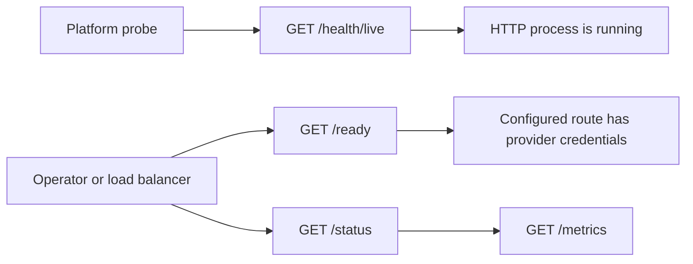

# Health and operations

Go Feather Route separates process health from provider readiness.



## Endpoints

- `GET /health/live` and `GET /health/liveliness` are unauthenticated liveness aliases. They return `200` when the HTTP process can answer.
- `GET /ready` is unauthenticated and returns `200` when at least one configured model route has provider credentials. It returns `503` with a degraded status when no provider is ready.
- `GET /status` is unauthenticated and returns gateway counters and configured model count.
- `GET /status/models` lists configured model aliases. `GET /status/models/{model}` reports the route and whether its provider credentials are present.
- `GET /metrics` is unauthenticated and returns a small Prometheus-compatible text response.

The metrics include total requests, errors, active requests, active streams,
completed streams, retry count, configured model count, and response bytes.

Health endpoints do not make paid provider calls. Readiness confirms local
configuration only; provider availability should be monitored with a bounded
synthetic request or provider-specific monitoring policy.

## Container healthcheck

The image healthcheck calls:

```bash
go-feather-route healthcheck
```

It probes `http://127.0.0.1:4000/health/liveliness` and is intentionally
independent of provider credentials so container orchestration can distinguish
an alive process from a provider-ready gateway.
