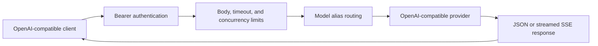
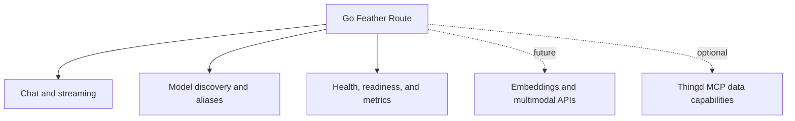

  <strong>Reference performance:</strong> the benchmark harness reports latency,
  throughput, CPU, memory, I/O, process count, cgroup peaks, and OOM state
  where the host exposes those measurements. See the benchmark guide for the
  measurement environment and interpretation rules.

  

Gateway idle RSS

~4.5 MiB

Reference container measurement

  

Proxy p50

0.64 ms

16 requests / concurrency 4

  

Gateway image

8.7 MB

Static arm64 image

  

Streaming

SSE

Forwarded without full buffering

## How a request moves

## Choose a starting path

  <a class="path-card" href="https://sayanmohsin.github.io/go-feather-route/getting-started"><h3>Start routing</h3>
Configure one provider and send an OpenAI-compatible request.
</a>
  <a class="path-card" href="https://sayanmohsin.github.io/go-feather-route/docker"><h3>Deploy with Docker</h3>
Use the non-root multi-architecture image with runtime-injected secrets.
</a>
  <a class="path-card" href="https://sayanmohsin.github.io/go-feather-route/benchmarks"><h3>Measure the gateway</h3>
Compare routing overhead and resource use with the pinned LiteLLM reference image.
</a>
  <a class="path-card" href="https://sayanmohsin.github.io/go-feather-route/thingd-mcp"><h3>Connect Thingd later</h3>
Keep the router standalone, then add data-aware capabilities through MCP.
</a>

## Long-term direction

The project is designed to remain a small operational boundary as its
capabilities grow: more compatible providers, embeddings and multimodal
requests, per-tenant quotas, usage metrics, health-aware routing, graceful
degradation, memory-aware deployment profiles, and optional Thingd MCP data
capabilities.

## Start in one command

<pre class="terminal-panel"><code>docker run --rm -p 4000:4000 \
  -e GOFEATHERROUTE_API_KEY=gateway-key \
  -e OPENAI_API_KEY=your-key \
  sayanmohsin/go-feather-route:0.1.0</code></pre>

The router owns authentication, limits, provider selection, streaming, and
operational boundaries. Provider credentials are injected at runtime. Read the
  [security model](https://sayanmohsin.github.io/go-feather-route/security),
  [API reference](https://sayanmohsin.github.io/go-feather-route/api), and
  [deployment guide](https://sayanmohsin.github.io/go-feather-route/deployment)
  before placing it behind a public endpoint.
