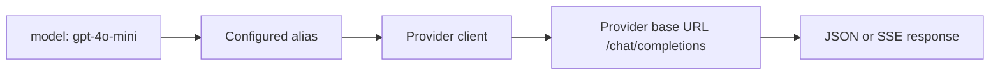

# Routing

Model aliases map client-facing model names to configured provider names.

The router first checks an explicit alias in `routes`. For an unaliased model,
it can use the provider prefix in `provider/model` form when that provider is
configured. Provider base URLs and credentials are loaded from the typed
configuration system.

Non-streaming requests use one bounded retry for transient transport, 5xx, and
429 responses. Streaming requests are not retried after the upstream stream has
started. All upstream work inherits the request context and gateway timeout.
