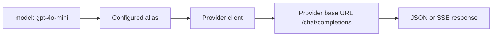

# Routing

Model aliases and provider rules map client-facing model names to configured
provider names. They are loaded from YAML, so adding a provider or model does
not require a Go code change.

The router first checks an exact `model_list` alias. For an unlisted model, it
can use a matching `route_rules` pattern, including the provider prefix in
`provider/model` form. Provider aliases are translated to upstream model
identifiers at the provider boundary, so clients keep stable names while
Ollama can use names such as `qwen3:4b` and `nomic-embed-text`. Provider base
URLs and credentials are loaded from the typed configuration system.

Non-streaming requests use one bounded retry for transient transport, 5xx, and
429 responses. Streaming requests are not retried after the upstream stream has
started. All upstream work inherits the request context and gateway timeout.
